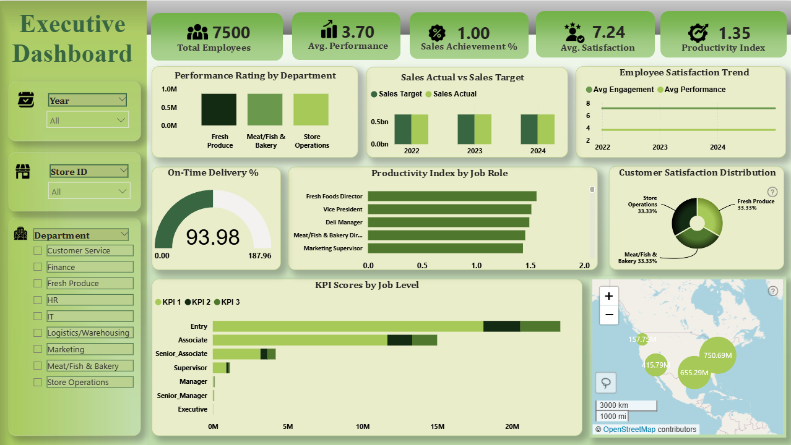

# Statewise-GSDP-Analysis

## 📌 Project Overview
This project presents a **Tableau dashboard** analyzing the  
**Per Capita Net State Domestic Product (NSDP)** across Indian states for the periods:
- **1990–1995**
- **2005–2010**

The aim of this project is to provide **economic insights for policy and governance** by examining disparities and growth trends in per capita NSDP across Indian states and union territories.  

---

## 📊 Dashboard Features
- **Total Value (All India)** → Aggregated NSDP across all states  
- **Average Value per State** → Benchmark to compare state performance  
- **Highest & Lowest Value States** → Identifies top and bottom performers  
- **Top States Comparison** → Bar chart comparing high-value states  
- **Trend Over Time** → Multi-year trend analysis (1990–95, 2005–10)  
- **States vs Years (Heatmap)** → Quick glance at growth patterns  
- **State-wise Distribution (Map)** → Geographic distribution of per capita NSDP  

---

## 📊 Key Insights
- **Top States**: Goa, Delhi, and Chandigarh consistently rank high in per capita NSDP.  
- **Lower Value States**: Bihar, Orissa, and Uttar Pradesh remain at the bottom.  
- **Trends Over Time**: A sharp increase in per capita NSDP is observed post-2005.  
- **State-wise Distribution**: Highlights regional disparities, showing stronger economies in coastal and metropolitan states.  

---

## 🛠 Tools & Technologies Used
### 🔹 Data Collection & Cleaning
- **Excel** → Extracted state-wise NSDP data from multiple yearly sheets (1990–95, 2005–10).  
- Removed headers, standardized state names, merged datasets into a master table (`master_table.xlsx`).  

### 🔹 Data Analysis & Visualization
- **Tableau Desktop**  
  - Built interactive dashboard (`Statewise-GSDP-Analysis.twbx`).  
  - Created KPI cards, bar charts, heatmaps, line charts, and geographical maps.  
  - Combined multiple datasets into a single visualization framework.  

### 🔹 Version Control & Sharing
- **GitHub** → Repository for datasets, Tableau workbook, and dashboard screenshots.  
- Ensures reproducibility and transparency.  

---

## 📂 Repository Contents
- `1.png, 2.png, 3.png` → Tableau dashboard screenshots  
- `Statewise-GSDP-Analysis.twbx` → Tableau packaged workbook (open in Tableau Desktop/Public)  
- `GSDP.xlsx` → Processed dataset  
- `Per_Capita_NSDP.xlsx` → Raw per capita NSDP data  
- `master_table.xlsx` → Cleaned and combined dataset used in Tableau  
- `README.md` → Project documentation  

---

## 🚀 How to Use
1. Clone/download this repository.  
2. Open `Statewise-GSDP-Analysis.twbx` in **Tableau Desktop** (or Tableau Public).  
3. Use the included datasets (`.xlsx`) to explore the dashboard.  
4. View static previews in the uploaded screenshots (`1.png, 2.png, 3.png`).  

---

## 🙋 Author
👨‍💻 **Dipra Gupta**  
🔗 [LinkedIn Profile](https://www.linkedin.com/in/dipra-gupta-12b2b0374)  

---
